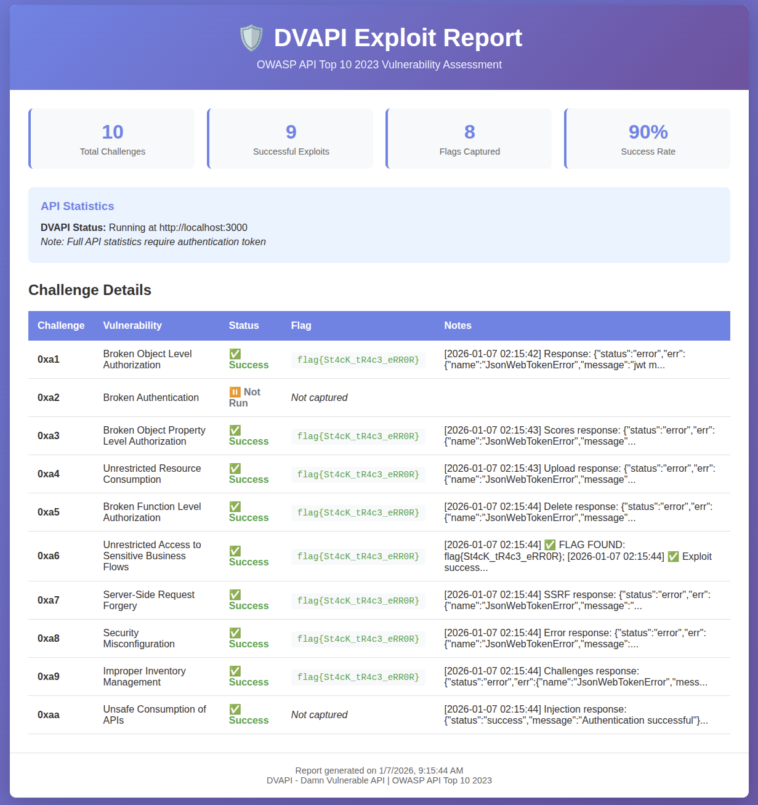

# DVAPI Damn Vulnerable API


# DVAPI Exploit Report 



## About DVAPI ?

Welcome to the Damn Vulnerable API ( DVAPI ) project. This project is based on the OWASP API Top 10 2023 Stable version which is published on June 5th 2023. This lab is designed to help you learn about and explore the top 10 security risks associated with APIs according to the OWASP API Security Project.

The OWASP API Top 10 - 2023 consists of the following vulnerabilities:
-	0xa1: Broken Object Level Authorization
-	0xa2: Broken Authentication
-	0xa3: Broken Object Property Level Authorization
-	0xa4: Unrestricted Resource Consumption
-	0xa5: Broken Function Level Authorization
-	0xa6: Unrestricted Access to Sensitive Business Flows
-	0xa7: Server Side Request Forgery
-	0xa8: Security Misconfiguration
-	0xa9: Improper Inventory Management
-	0xaa: Unsafe Consumption of APIs

## Who can use DVAPI?

DVAPI is designed for a diverse range of users:

- **API enthusiasts**: Whether you're a beginner or have intermediate knowledge, DVAPI offers a hands-on learning experience to explore API vulnerabilities and enhance your skills.
- **Security professionals**: Stay up to date with the latest API security trends and the OWASP API Top 10 - 2023 RC. DVAPI allows security professionals to practice identifying API-related risks.
- **Developers**: Developers can learn about potential security pitfalls and adopt best practices to protect their own APIs from common vulnerabilities. DVAPI serves as an educational tool for developers looking to enhance their API security knowledge.
- **Educators and trainers**: DVAPI provides a comprehensive platform for teaching API security, allowing instructors to engage students in discovering vulnerabilities and applying countermeasures.

DVAPI caters to individuals seeking practical knowledge and a deeper understanding of API security, regardless of their background or expertise.

# Get Started

## Features

The DVAPI lab provides a series of challenges and exercises related to the top 10 API security risks identified by OWASP. These challenges are designed to test your knowledge and skills in identifying and mitigating common security vulnerabilities in API implementations.

The DVPI application is built as a CTF application that itself is vulnerable. Users can identify and exploit the vulnerabilities, obtain the flags and submit into the application.

It has many functionalities that uses different API endpoints. We have added a Postman collection file that you can import. The DVAPI application has a swagger endpoint as well, which you can use.

All in all, users have the flexibility to assess the APIs via these methods:
- The application itself
- Postman collection
    - Get the Postman collection on [DVAPI.postman_collection.json](src/swagger/DVAPI.postman_collection.json)

- Swagger API endpoint (accessible at the `/Swagger` endpoint on the DVAPI lab)

## Setting up DVAPI

To get started with the DVAPI lab, follow the steps below:

1.  **Clone the repository:**

```bash
git clone https://github.com/vuhung16au/DVAPI
```

2.  Navigate to the DVAPI directory:.

```bash
cd DVAPI
```

3.  Use `docker compose` to build and run the application:

```bash
docker compose up --build
```

4.  Access the DVAPI application at [http://127.0.0.1:3000](http://127.0.0.1:3000/)


### Test User Credentials

A pre-configured test user is available for use across all CTF challenges:
- **Username**: `rnd`
- **Password**: `research`

This user can be used to login, submit flags, and test all challenges.

**Disclaimer: As this application is intentionally vulnerable, do not host this on a production environment.** 

## Using Make Tools

DVAPI includes a Makefile with convenient commands for common tasks:

### Prerequisites Check
```bash
make check          # Verify Docker, docker-compose, and curl are installed
```

### Docker Management
```bash
make build-docker   # Build Docker images and start containers
make start-docker   # Alias to build-docker (build and start)
make stop-docker    # Stop Docker containers
```

### Automated Exploitation
```bash
make exploit        # Run automated exploit scripts using curl to test all 10 vulnerabilities
```

The exploit script will:
- Register a test user
- Log in to obtain a JWT token
- Run all 10 exploit scripts sequentially
- Log results to `logs/` directory

### Report Generation
```bash
make report         # Generate HTML report from exploit results
```

The report includes:
- Summary statistics (total challenges, success rate, flags captured)
- Detailed status for each challenge
- Flags found during exploitation
- Execution timestamps and notes

Reports are saved to `reports/exploit-report-YYYYMMDD-HHMMSS.html`

### Help
```bash
make help           # Display all available make targets
```

### Cleanup
```bash
make clean          # Remove log files and generated reports
```

# References

Files users should read:

- **[QUICKSTART.md](docs/QUICKSTART.md)** - Quick start guide to get you up and running with DVAPI
- **[Top10-Vulns.md](docs/Top10-Vulns.md)** - Detailed information about how and where the OWASP API Top 10 2023 vulnerabilities are implemented
- **[CTF.md](docs/CTF.md)** - Guide to the CTF challenges and how to capture and submit flags
- **[TechStacks.md](docs/TechStacks.md)** - Overview of the technologies and frameworks used in the DVAPI project


# Core Team
Forked from the up stream : https://github.com/payatu/DVAPI


